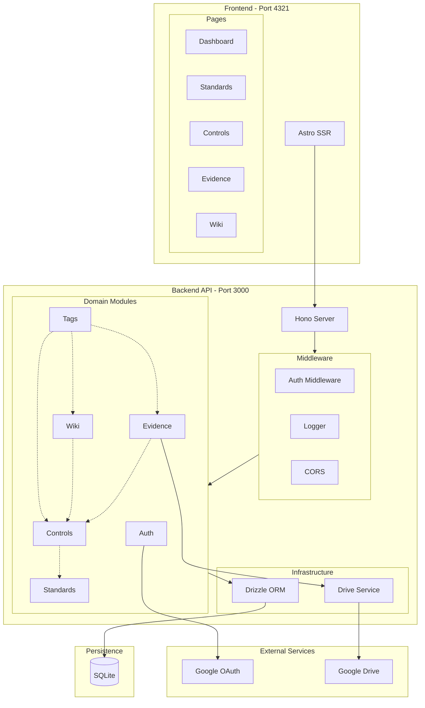
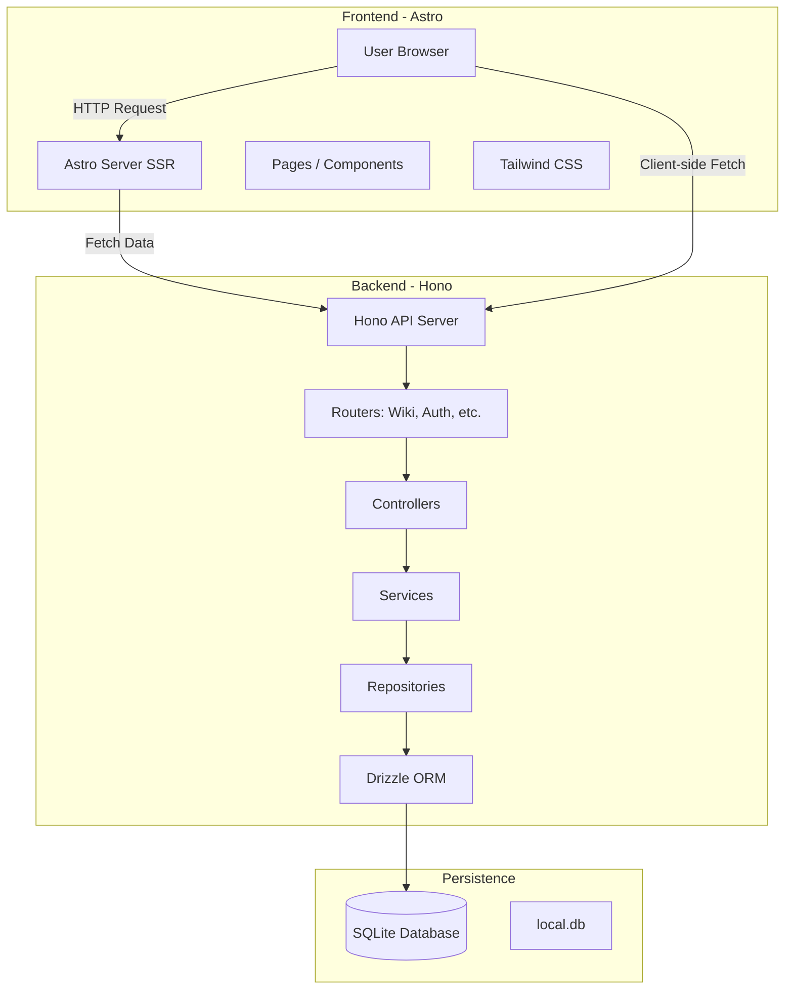
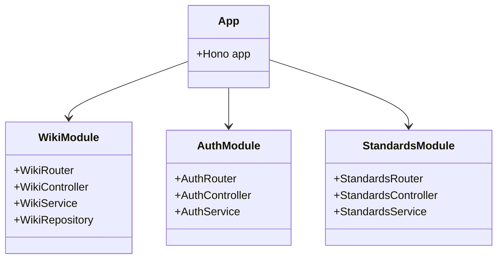
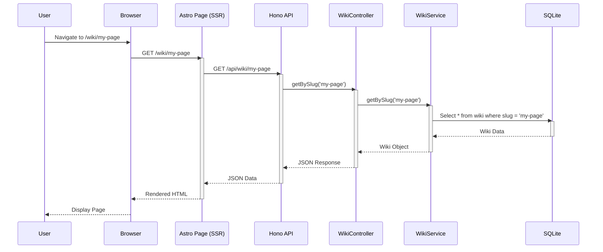
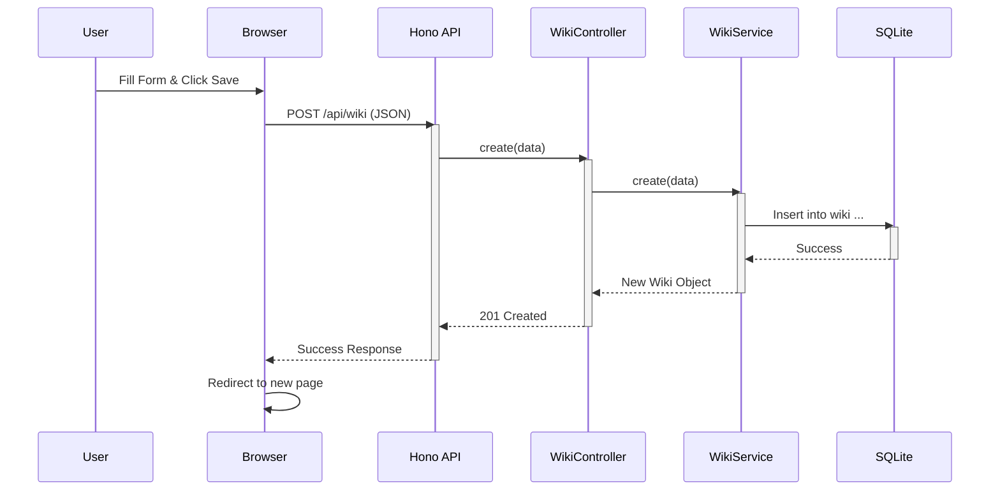
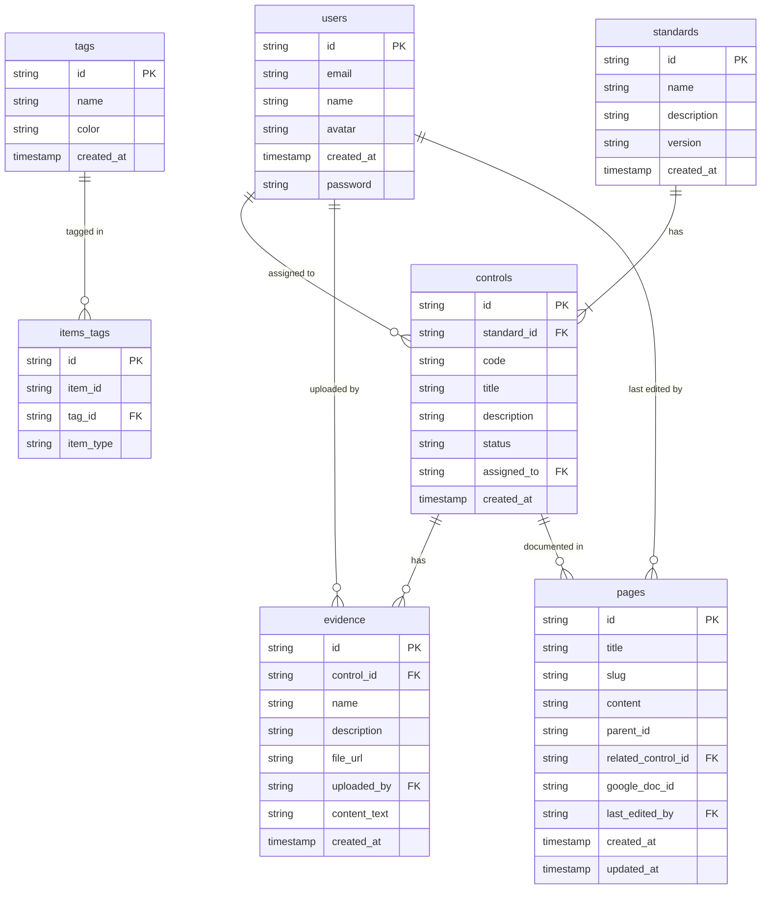

# Architecture and Flow Diagrams

## High-Level Component Diagram

## System Architecture

## Module Structure

The backend is organized into modules.

## Request Flow: View Wiki Page

This sequence diagram shows the flow when a user views a wiki page.

## Request Flow: Create Wiki Page

This sequence diagram shows the flow when a user creates a new wiki page.

## Entity Relationship Diagram

This diagram shows the database schema and relationships.

