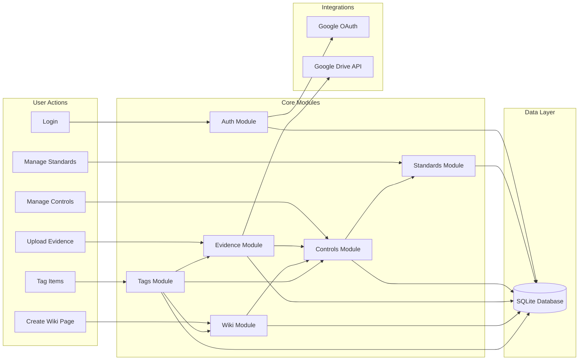

# AllwareWiki - Functional Specification

## Purpose

AllwareWiki is a **Compliance Management and Documentation System** designed to help organizations manage and document their adherence to security and compliance standards (e.g., ISO 27001, SOC 2, NIST).

The application provides a centralized platform to:
1.  **Track Compliance Standards**: Define and manage multiple frameworks.
2.  **Manage Controls**: Map specific requirements from each standard.
3.  **Collect Evidence**: Attach files or documents to prove compliance.
4.  **Document Processes**: A wiki system to describe procedures and policies.

---

## Core Functionalities

### 1. Standards Management
-   Create, Read, Update, Delete (CRUD) for compliance standards.
-   Standards contain metadata like name, version, and description.
-   Each standard has multiple **Controls**.

### 2. Controls Management
-   CRUD for controls within a standard.
-   Each control has a code (e.g., "1.1"), title, description, and status.
-   Controls can be assigned to a user.
-   Controls link to **Evidence** and **Wiki Pages**.

### 3. Evidence Management
-   Attach evidence (files, documents) to a control.
-   Files are uploaded to **Google Drive** for storage.
-   Evidence has metadata like name, description, and uploader.

### 4. Wiki System
-   A knowledge base to document policies, procedures, and processes.
-   Pages are written in **Markdown**, support hierarchy (parent/child pages), and can be linked to a specific control.
-   Supports linking to Google Docs.

### 5. Tags System
-   A polymorphic tagging system for pages, evidence, and controls.
-   Enables cross-referencing and categorization.

### 6. Authentication
-   OAuth-based user authentication (Google).
-   New users are auto-registered on first login.
-   Protected API routes via `authMiddleware`.

### 7. Google Drive Integration
-   Upload, delete, and retrieve files from Google Drive.
-   Extract text content from Google Docs.

---

## Functionality Relationship Diagram

---

## User Requirements Matrix

| User Requirement | Functionality | Modules Involved |
|---|---|---|
| I need to track compliance with multiple standards. | Standards Management | Standards |
| I need to see what controls are part of a standard and their status. | Controls Management | Standards, Controls |
| I need to assign controls to team members. | User Assignment | Controls, Auth |
| I need to upload proof of compliance. | Evidence Management | Evidence, Google Drive |
| I need to document internal policies and link them to controls. | Wiki System | Wiki, Controls |
| I need to categorize and search for related items. | Tags System | Tags, Wiki, Evidence, Controls |
| I need secure access to the system. | Authentication | Auth, Google OAuth |

---

## Composite Capabilities

All these functionalities combine to provide:

1.  **Audit Readiness**: All evidence, documentation, and control statuses are centralized for easy audit access.
2.  **Traceability**: Every piece of evidence and documentation is linked back to a specific control, providing a clear compliance trail.
3.  **Collaboration**: Multiple team members can work on controls, upload evidence, and edit wiki pages with tracked authorship.
4.  **Searchability**: Tags enable cross-referencing across different entity types, making it easy to find related information.
5.  **Living Documentation**: The wiki system allows policies and procedures to evolve alongside the compliance requirements.
